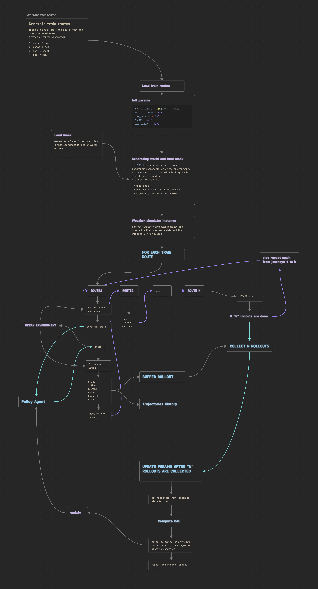

### Objective
The objective of this project is to perform a set of experiments on a model whose purpose is to dynamically generate an action for a ship in the midst of a route in the sea, such that it can follow the current most optimal route to its goal detination, given its start destination. The objective is not just to devise a model that performs the best - though that is a crucial objective - but the goal is also to examine what works, what doesn't and why it is so. 

### Resources:
I have used the Natural Earth 50m land database 
Land data: https://www.naturalearthdata.com/downloads/50m-physical-vectors/
to help identify land, sea and coast points.

### Constraints and conditions
- The global weather conditions change every second.
- The agent should generate actions dynamically over each timestep rather than only 1 path at the starting of the journey. This is, as per me, equivalent to generating entire paths every second or dynamically changing paths, because, for the current timestep, the action that the ship takes, whether an entire path is visible or whether only that action is visible, is same. Therefore, in my opinion, the agent will be able to perform similarly well if the agent is trained to generate a single action rather than to generate an entire path (keeping performance optimal of course) and it will also be computationally cheaper. 

## Framework components
This framework doesn't just consist of the model - it consists of several other components that are just as essential as the model. 

For reference, the "main" code file that you could run is `reinforce.py`, `parallel_journey.py` or `PJ_curriculum.py` depending on the experiment.

### 1. REINFORCE EXPERIMENT
Here, I am 

### 2. PARALLEL_JOURNEY EXPERIMENT

The main idea behind this experiment is that here an RL model is trained on "k" parallel journeys.

Now, if we train an RL agent to generate action on only one journey (1 set of start and end coordinates), then it will only learn to generate action for that path. Then if you want to make it generate actions for another set of start and end points you would need to train it again. So the deployment scenario would be that every time the user introduces a new journey the model parameters would need to be changed (model trained again) which would be computationally expensive.

To prevent this, I defined the deployment goal to be such that every time a user gives its "state" - journey, weather etc the agent which is already trained will run (no change in params - they will just be used) and it will generate a single action (here, it is the degree that the ship has to turn. The same model can be extrapolated to output degree along with direction, aka velocity, by changing the number of output neurons in the neural network and introducing speed effect in the error function.)

To satisfy this deployment condition, the agent's performance needs to be independent of start and end points. Therefore, I am training the agent on `k` different journeys simultaneously, where the start and end points are part of the input to *every* prediction. The exact flow is described in the chart below.

Key components are explained below:

## PPO Model: Action Selection and Update

The routing agent uses an **Actor-Critic PPO (Proximal Policy Optimization)** architecture. The actor learns a probability distribution over continuous heading actions which are angles that the ship has to turn (theta), while the critic estimates the value of the current state.

### Action Selection — `act()`

Given the current state \(s_t\), the policy network outputs the parameters of a Gaussian action distribution:

$$
\mu_t,\log\sigma_t = \pi_\theta(s_t)
$$

The standard deviation is obtained as:

$$
\sigma_t = \exp(\log\sigma_t)
$$

with the log standard deviation clipped to:

$$
-5 \leq \log\sigma_t \leq 2
$$

The raw action is then sampled from the Gaussian policy:

$$
a_t^{raw} \sim \mathcal{N}(\mu_t,\sigma_t^2)
$$

The log probability of the sampled action is stored for the PPO update:

$$
\log \pi_\theta(a_t^{raw}|s_t)
$$

The critic simultaneously estimates the value of the current state:

$$
V_\phi(s_t)
$$

#### Action Transformation

The raw action is transformed into a valid angular heading using a hyperbolic tangent:

$$
\theta_t^{base} = \pi\tanh(a_t^{raw})
$$

This constrains the base heading to:

$$
-\pi < \theta_t^{base} < \pi
$$

The angle is then wrapped to the interval \([-\pi,\pi)\):

$$
\theta_t^{wrapped} = (\theta_t^{base}+\pi) \bmod(2\pi)-\pi
$$

Finally, the goal direction is incorporated as a directional bias:

$$
\boxed{\theta_t = \theta_t^{wrapped} + 0.5\,d_t^{goal} }
$$

where \(d_t^{goal}\) represents the direction from the ship toward the destination.

Thus, the actor does not directly output the final geographic heading. Instead, it learns a stochastic **base direction**, which is subsequently combined with the direction toward the goal.

The action-selection process can be summarized as:

$$
s_t
\rightarrow
(\mu_t,\sigma_t)
\rightarrow
a_t^{raw}
\rightarrow
\theta_t^{base}
\rightarrow
\theta_t
$$

The function returns:

* Selected heading \(\theta_t\)
* Log probability \(\log\pi_\theta(a_t^{raw}|s_t)\)
* State value \(V_\phi(s_t)\)
* Raw action \(a_t^{raw}\)

---

## PPO Update — `update()`

After collecting a rollout, the policy and value networks are updated using PPO.

### Advantage Normalization

The calculated advantages are normalized across the collected samples:

$$
\hat{A}_t =
\frac{A_t-\mu_A}
{\sigma_A+\epsilon}
$$

where:

* \(\mu_A\) is the mean advantage
* \(\sigma_A\) is the standard deviation of the advantages
* \(\epsilon=10^{-8}\) provides numerical stability

This improves the stability of the policy update.

### Probability Ratio

For each stored action, the updated policy calculates a new log probability:

$$
\log\pi_\theta(a_t|s_t)
$$

The probability ratio between the new and old policies is:

$$
r_t(\theta) =
\frac{
\pi_\theta(a_t|s_t)
}{
\pi_{\theta_{old}}(a_t|s_t)
}
$$

In implementation, this is computed in log-space:

$$
\boxed{
r_t(\theta)=
\exp
\left(
\log\pi_\theta(a_t|s_t)
-
\log\pi_{\theta_{old}}(a_t|s_t)
\right)
}
$$

### Clipped Surrogate Objective

PPO prevents excessively large policy updates by clipping the probability ratio.

The unclipped objective is:

$$
L_t^{CLIP,1}=
r_t(\theta)\hat{A}_t
$$

The clipped objective is:

$$
L_t^{CLIP,2}=
\operatorname{clip}
\left(
r_t(\theta),
1-\epsilon,
1+\epsilon
\right)
\hat{A}_t
$$

The PPO policy objective is:

$$
\boxed{
L^{CLIP}=
\mathbb{E}_t
\left[
\min
\left(
r_t(\theta)\hat{A}_t,
\operatorname{clip}
(r_t(\theta),1-\epsilon,1+\epsilon)
\hat{A}_t
\right)
\right]
}
$$

Since PyTorch optimizers minimize losses, the implementation uses the negative of this objective:

$$
L_{policy}=
-L^{CLIP}
$$

This clipping constrains how much the new policy can deviate from the policy that generated the collected trajectories.

---

### Value Function Loss

The critic predicts:

$$
V_\phi(s_t)
$$

and is trained toward the estimated return:

$$
R_t
$$

using mean squared error:

$$
\boxed{
L_{value}=
\mathbb{E}_t
\left[
(R_t-V_\phi(s_t))^2
\right]
}
$$

---

### Entropy Regularization

The entropy of the Gaussian policy distribution is calculated as:

$$
H(\pi_\theta)=
-\mathbb{E}
\left[
\log\pi_\theta(a_t|s_t)
\right]
$$

Higher entropy corresponds to greater exploration.

The total PPO loss combines the policy loss, value loss, and entropy regularization:

$$
\boxed{
L_{total}=
L_{policy} +
c_vL_{value}-
c_HH
}
$$

where:

* \(L_{policy}\) = PPO clipped policy loss
* \(L_{value}\) = critic/value loss
* \(H\) = policy entropy
* \(c_v\) = value loss coefficient
* \(c_H\) = entropy coefficient

The gradients of the combined actor-critic loss are then clipped to a maximum norm of \(0.5\) before the optimizer update.

---

## Generalized Advantage Estimation — `calculate_gae()`

The implementation uses **Generalized Advantage Estimation (GAE)** to estimate how much better or worse an action performed compared with the critic's expectation.

For each timestep \(t\), the temporal-difference error is:

$$
\boxed{
\delta_t=
r_t +
\gamma V(s_{t+1})(1-d_t) -
V(s_t)
}
$$

where:

* \(r_t\) = reward at timestep \(t\)
* \(V(s_t)\) = value estimate at timestep \(t\)
* \(V(s_{t+1})\) = next-state value estimate
* \(\gamma\) = discount factor
* \(d_t\) = terminal indicator

The factor

$$
1-d_t
$$

prevents bootstrapping from the next state when the journey has terminated.

### Recursive GAE Calculation

Starting from the end of the trajectory, GAE is calculated recursively:

$$
\boxed{
A_t=
\delta_t+
\gamma\lambda(1-d_t)A_{t+1}
}
$$

where:

* \(A_t\) = advantage estimate
* \(\gamma\) = reward discount factor
* \(\lambda\) = GAE smoothing parameter

In the implementation:

$$
\gamma=0.99
$$

and

$$
\lambda=0.95
$$

The recursion is performed backwards through the trajectory:

$$
A_T
\rightarrow
A_{T-1}
\rightarrow
\cdots
\rightarrow
A_0
$$

This allows the advantage at each timestep to incorporate information from multiple future rewards while controlling the bias-variance trade-off through \(\lambda\).

### Return Calculation

Once the advantages have been calculated, the target return for the value network is obtained as:

$$
\boxed{
R_t=A_t+V(s_t)
}
$$

The function therefore returns two quantities:

$$
\boxed{
\{A_t\}_{t=0}^{T-1}
}
$$

and

$$
\boxed{
\{R_t\}_{t=0}^{T-1}
}
$$

### Complete PPO Training Loop

The overall training process can therefore be summarized as:

$$
s_t
\rightarrow
\text{Actor}
\rightarrow
a_t
\rightarrow
\text{Environment}
\rightarrow
r_t,s_{t+1}
$$

After collecting a rollout:

$$
\{s_t,a_t,r_t,V(s_t)\}
\rightarrow
\text{GAE}
\rightarrow
\{A_t,R_t\}
$$

followed by:

$$
\{s_t,a_t,\log\pi_{old},A_t,R_t\}
\rightarrow
\text{PPO Update}
\rightarrow
\theta,\phi
$$

where \(\theta\) represents the actor parameters and \(\phi\) represents the critic parameters.
