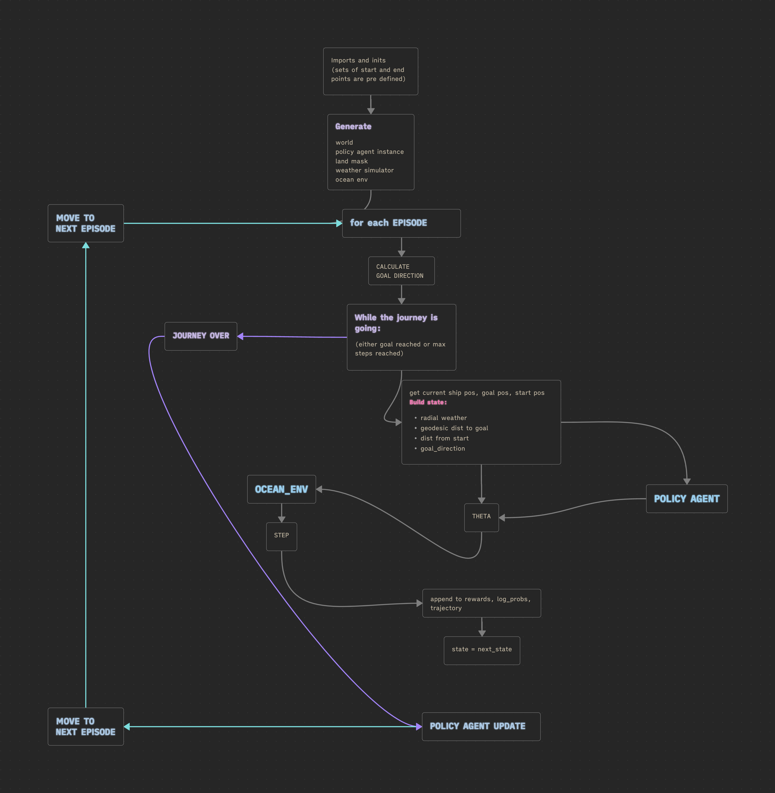

# Dynamic ship movement using reinforcement learning

### Objective
The objective of this project is to perform a set of experiments on a model whose purpose is to dynamically generate an action for a ship in the midst of a route in the sea, such that it can follow the current most optimal route to its goal detination, given its start destination. The objective is not just to devise a model that performs the best - though that is a crucial objective - but the goal is also to examine what works, what doesn't and why it is so. 

### Resources:
I have used the Natural Earth 50m land database 
Land data: https://www.naturalearthdata.com/downloads/50m-physical-vectors/
to help identify land, sea and coast points.

### Constraints and conditions
- The global weather conditions change every second.
- The agent should generate actions dynamically over each timestep rather than only 1 path at the starting of the journey. This is, as per me, equivalent to generating entire paths every second or dynamically changing paths, because, for the current timestep, the action that the ship takes, whether an entire path is visible or whether only that action is visible, is same. Therefore, in my opinion, the agent will be able to perform similarly well if the agent is trained to generate a single action rather than to generate an entire path (keeping performance optimal of course) and it will also be computationally cheaper. 

## Framework components
This framework doesn't just consist of the model - it consists of several other components that are just as essential as the model. 

For reference, the "main" code file that you could run is  `parallel_journey.py` or `PJ_curriculum.py` or `reinforce.py`, depending on the experiment.

## 1. REINFORCE EXPERIMENT
(this has a huge caveat which I found later, which serves as the basis for Experiment 2). Consider the flowchart given below:

### Training and State Construction

The routing agent is trained in a dynamic geographic environment where the ship makes a decision at every timestep based on its current location, destination, and surrounding weather conditions.

The overall interaction follows the reinforcement learning loop:

$$ s_t \rightarrow \text{Policy} \rightarrow a_t \rightarrow
\text{Environment}
\rightarrow
(r_t,s_{t+1})
$$

The process is repeated until the ship reaches the destination or the maximum number of steps is exceeded.

---

## 1. Journey Definition

Each journey is defined by a fixed starting coordinate and destination:

$$
S=(\phi_s,\lambda_s)
$$

$$
G=(\phi_g,\lambda_g)
$$

where:

* \(\phi\) = latitude
* \(\lambda\) = longitude

Multiple test routes are defined to evaluate the learned policy under different geographic conditions, including:

* Short routes
* Medium routes
* Long routes
* Equatorial crossings
* International dateline crossings
* Northern hemisphere routes
* Southern hemisphere routes

During an episode, the start and goal remain fixed while the ship position changes.

---

## 2. Dynamic Weather Environment

The environment contains a time-varying weather field:

$$
W_t = W(\phi,\lambda,t)
$$

At each timestep, the weather simulator can update the environmental conditions:

$$
W_t
\rightarrow
W_{t+1}
$$

The ship therefore does not make all routing decisions using a single static weather map. Instead, the state at each timestep contains information about the weather surrounding the ship's **current position**.

The intended interaction is:

$$
s_t
\rightarrow
a_t
\rightarrow
\text{Ship Movement}
\rightarrow
W_{t+1}
\rightarrow
s_{t+1}
$$

This allows the agent to adapt its route as weather conditions evolve.

> **Implementation note:** In the current version, the `weather.update()` call inside the timestep loop is commented out. Therefore, the weather field is currently initialized once rather than updated after every step. The dynamic formulation above represents the intended architecture.

---

## 3. State Construction

At every timestep, a new state is constructed from three types of information:

1. Local radial weather information
2. Distance to the destination
3. Distance travelled from the starting point
4. Direction toward the destination

The state is represented as:

$$
\boxed{
s_t =
[
W_t^{radial},
d_t^{goal},
d_t^{start},
\sin(\beta_t),
\cos(\beta_t)
]
}
$$

where \(W_t^{radial}\) represents the local weather surrounding the ship and \(\beta_t\) is the bearing from the current ship position toward the destination.

### Radial Weather Representation

Instead of providing the complete global weather grid to the neural network, weather is sampled around the current ship position.

For a set of predefined radii \(r_1,r_2,\ldots,r_n\), weather information is collected at multiple points surrounding the ship:

$$
W_t^{radial}
=
\{
W(p_1),W(p_2),\ldots,W(p_N)
\}
$$

Each sampled point contains local weather information such as wind speed and wind direction.

The resulting radial representation is flattened before being passed to the policy:

$$
W_t^{radial}
\rightarrow
\operatorname{flatten}(W_t^{radial})
$$

This gives the agent a localized view of the weather around its current position.

---

## 4. Distance to Goal

The distance between the ship and destination is calculated using geodesic distance on the Earth's surface.

Let:

$$
P_t=(\phi_t,\lambda_t)
$$

be the current ship position and:

$$
G=(\phi_g,\lambda_g)
$$

be the destination.

The geodesic distance is:

$$
d_t^{goal}
=
D(P_t,G)
$$

where \(D(\cdot,\cdot)\) represents the Earth's surface distance.

The distance is normalized before being provided to the agent:

$$
\boxed{
\tilde d_t^{goal}
=
\frac{d_t^{goal}}{20000}
}
$$

where approximately \(20,000\) km represents the characteristic maximum distance scale of the Earth's surface.

---

## 5. Distance from Starting Point

The distance travelled from the original starting location is also included in the state.

Let:

$$
S=(\phi_s,\lambda_s)
$$

be the fixed starting point.

Then:

$$
d_t^{start}
=
D(S,P_t)
$$

and the normalized value is:

$$
\boxed{
\tilde d_t^{start}
=
\frac{d_t^{start}}{20000}
}
$$

Including both distances allows the agent to distinguish between:

* How far it still needs to travel
* How far it has already travelled

---

## 6. Bearing to the Goal

The direction from the ship toward the destination is represented by a bearing:

$$
\beta_t
=
\operatorname{Bearing}(P_t,G)
$$

Because angular values wrap around at \(2\pi\), directly providing the angle can introduce a discontinuity.

For example:

$$
359^\circ
\approx
0^\circ
$$

but numerically these values appear far apart.

To avoid this problem, the bearing is encoded using sine and cosine:

$$
\boxed{
b_t^{sin}=\sin(\beta_t)
}
$$

$$
\boxed{
b_t^{cos}=\cos(\beta_t)
}
$$

Therefore, the direction component of the state is:

$$
B_t=
[
\sin(\beta_t),
\cos(\beta_t)
]
$$

This provides a continuous representation of direction.

---

## 7. Complete Agent State

The final state provided to the policy is:

$$
\boxed{
s_t=
[
\operatorname{flatten}(W_t^{radial}),
\tilde d_t^{goal},
\tilde d_t^{start},
\sin(\beta_t),
\cos(\beta_t)
]
}
$$

Thus, the agent receives both **local environmental information** and **global positional information**.

### 8. Action Selection

The policy receives the state:

$$
s_t
$$

and produces a continuous heading action:

$$
a_t \sim \pi_\theta(a|s_t)
$$

The raw action is transformed into a heading angle:

$$
\theta_t^{base}
=
\pi\tanh(a_t)
$$

The heading is then combined with the goal direction to bias movement toward the destination:

$$
\boxed{
\theta_t
=
\theta_t^{base}
+
0.5\beta_t
}
$$

where \(\beta_t\) is the current bearing toward the goal.

The resulting \(\theta_t\) is passed to the ocean environment, which determines the ship's next position.

---

### 9. Ship Movement

Given the current position:

$$
P_t=(\phi_t,\lambda_t)
$$

the ship moves according to its selected heading.

For a predefined movement step \(\Delta\):

$$
\boxed{
\phi_{t+1}
=
\phi_t+\Delta\cos(\theta_t)
}
$$

$$
\boxed{
\lambda_{t+1}
=
\lambda_t+\Delta\sin(\theta_t)
}
$$

Latitude is constrained to the valid geographic range, while longitude is wrapped around the globe.

The resulting position is:

$$
P_{t+1}
=
(\phi_{t+1},\lambda_{t+1})
$$

---

### 10. Environment Interaction

After the action is executed, the environment evaluates the resulting position.

The basic transition is:

$$
(s_t,a_t)
\rightarrow
(s_{t+1},r_t,d_t)
$$

where:

* \(s_t\) = current state
* \(a_t\) = selected heading
* \(r_t\) = reward
* \(s_{t+1}\) = resulting state
* \(d_t\) = episode termination indicator

### Land Collision

If the resulting position lies on land:

$$
Land(P_{t+1})=1
$$

the movement is rejected and a large negative reward is assigned:

$$
\boxed{
r_t=-100
}
$$

The episode is not immediately terminated in the current implementation, allowing the agent to attempt another direction.

If:

$$
Land(P_{t+1})=0
$$

the ship is allowed to move to the new position.

---

## 11. Episode Termination

The episode terminates when the ship reaches sufficiently close to the destination.

If:

$$
d(P_{t+1},G)<R_{goal}
$$

where \(R_{goal}\) is the goal tolerance determined by the environment resolution, then:

$$
\boxed{
done=True
}
$$

and a large goal-completion reward is provided.

Otherwise:

$$
done=False
$$

The episode is also terminated when the maximum allowed number of steps is reached:

$$
t\geq T_{max}
$$

---

## 12. Reward Signal

The primary reward encourages progress toward the destination.

Let:

$$
d_t=D(P_t,G)
$$

and:

$$
d_{t+1}=D(P_{t+1},G)
$$

Then the distance-progress reward is:

$$
\boxed{
r_t^{distance}
=
d_t-d_{t+1}
}
$$

A positive value means that the ship moved closer to the destination, while a negative value means that it moved farther away.

The reward is normalized:

$$
\boxed{
\tilde r_t^{distance}
=
\frac{d_t-d_{t+1}}{100}
}
$$

The intended reward structure can incorporate additional environmental costs:

$$
\boxed{
r_t
=
r_t^{distance}
-
\alpha C_t^{weather}
-
\beta C_t^{collision}
+
R_{goal}
}
$$

where:

* \(C_t^{weather}\) = cost associated with unfavorable weather
* \(C_t^{collision}\) = collision penalty
* \(R_{goal}\) = destination completion bonus
* \(\alpha,\beta\) = weighting coefficients

The current implementation primarily uses the distance-progress component together with the land-collision penalty and goal-completion bonus.

---

## 13. Episode-Based Training

For each episode, the ship is reset to the same predefined start and goal coordinates.

The agent then repeatedly performs:

$$
\boxed{
\text{State Construction}
\rightarrow
\text{Action}
\rightarrow
\text{Environment Step}
\rightarrow
\text{Reward}
\rightarrow
\text{Next State}
}
$$

until the episode terminates.

During the episode, the following information is collected:

$$
\{s_t,a_t,r_t,\log\pi(a_t|s_t),V(s_t)\}_{t=0}^{T-1}
$$

These trajectory samples are then used by the PPO update.

## 2. PARALLEL_JOURNEY EXPERIMENT

The main idea behind this experiment is that here an RL model is trained on "k" parallel journeys.

Now, if we train an RL agent to generate action on only one journey (1 set of start and end coordinates), then it will only learn to generate action for that path. Then if you want to make it generate actions for another set of start and end points you would need to train it again. So the deployment scenario would be that every time the user introduces a new journey the model parameters would need to be changed (model trained again) which would be computationally expensive.

To prevent this, I defined the deployment goal to be such that every time a user gives its "state" - journey, weather etc the agent which is already trained will run (no change in params - they will just be used) and it will generate a single action (here, it is the degree that the ship has to turn. The same model can be extrapolated to output degree along with direction, aka velocity, by changing the number of output neurons in the neural network and introducing speed effect in the error function.)

To satisfy this deployment condition, the agent's performance needs to be independent of start and end points. Therefore, I am training the agent on `k` different journeys simultaneously, where the start and end points are part of the input to *every* prediction. The exact flow is described in the chart below.

Key components are explained below:

## PPO Model: Action Selection and Update

The routing agent uses an **Actor-Critic PPO (Proximal Policy Optimization)** architecture. The actor learns a probability distribution over continuous heading actions which are angles that the ship has to turn (theta), while the critic estimates the value of the current state.

### Action Selection — `act()`

Given the current state \(s_t\), the policy network outputs the parameters of a Gaussian action distribution:

$$
\mu_t,\log\sigma_t = \pi_\theta(s_t)
$$

The standard deviation is obtained as:

$$
\sigma_t = \exp(\log\sigma_t)
$$

with the log standard deviation clipped to:

$$
-5 \leq \log\sigma_t \leq 2
$$

The raw action is then sampled from the Gaussian policy:

$$
a_t^{raw} \sim \mathcal{N}(\mu_t,\sigma_t^2)
$$

The log probability of the sampled action is stored for the PPO update:

$$
\log \pi_\theta(a_t^{raw}|s_t)
$$

The critic simultaneously estimates the value of the current state:

$$
V_\phi(s_t)
$$

#### Action Transformation

The raw action is transformed into a valid angular heading using a hyperbolic tangent:

$$
\theta_t^{base} = \pi\tanh(a_t^{raw})
$$

This constrains the base heading to:

$$
-\pi < \theta_t^{base} < \pi
$$

The angle is then wrapped to the interval \([-\pi,\pi)\):

$$
\theta_t^{wrapped} = (\theta_t^{base}+\pi) \bmod(2\pi)-\pi
$$

Finally, the goal direction is incorporated as a directional bias:

$$
\boxed{\theta_t = \theta_t^{wrapped} + 0.5\,d_t^{goal} }
$$

where \(d_t^{goal}\) represents the direction from the ship toward the destination.

Thus, the actor does not directly output the final geographic heading. Instead, it learns a stochastic **base direction**, which is subsequently combined with the direction toward the goal.

The action-selection process can be summarized as:

$$
s_t
\rightarrow
(\mu_t,\sigma_t)
\rightarrow
a_t^{raw}
\rightarrow
\theta_t^{base}
\rightarrow
\theta_t
$$

The function returns:

* Selected heading \(\theta_t\)
* Log probability \(\log\pi_\theta(a_t^{raw}|s_t)\)
* State value \(V_\phi(s_t)\)
* Raw action \(a_t^{raw}\)

---

## PPO Update — `update()`

After collecting a rollout, the policy and value networks are updated using PPO.

### Advantage Normalization

The calculated advantages are normalized across the collected samples:

$$
\hat{A}_t =
\frac{A_t-\mu_A}
{\sigma_A+\epsilon}
$$

where:

* \(\mu_A\) is the mean advantage
* \(\sigma_A\) is the standard deviation of the advantages
* \(\epsilon=10^{-8}\) provides numerical stability

This improves the stability of the policy update.

### Probability Ratio

For each stored action, the updated policy calculates a new log probability:

$$
\log\pi_\theta(a_t|s_t)
$$

The probability ratio between the new and old policies is:

$$
r_t(\theta) =
\frac{
\pi_\theta(a_t|s_t)
}{
\pi_{\theta_{old}}(a_t|s_t)
}
$$

In implementation, this is computed in log-space:

$$ \boxed{r_t(\theta)=\exp \left( \log\pi_\theta(a_t|s_t)- \log\pi_{\theta_{old}}(a_t s_t) \right) }$$

### Clipped Surrogate Objective

PPO prevents excessively large policy updates by clipping the probability ratio.

The unclipped objective is:

$$
L_t^{CLIP,1}=
r_t(\theta)\hat{A}_t
$$

The clipped objective is:

$$
L_t^{CLIP,2}=
{clip}
\left(
r_t(\theta),
1-\epsilon,
1+\epsilon
\right)
\hat{A}_t
$$

The PPO policy objective is:

$$
\boxed{
L^{CLIP}=
\mathbb{E}_t
\left[
\min
\left(
r_t(\theta)\hat{A}_t,
{clip}
(r_t(\theta),1-\epsilon,1+\epsilon)
\hat{A}_t
\right)
\right]
}
$$

Since PyTorch optimizers minimize losses, the implementation uses the negative of this objective:

$$
L_{policy}=
-L^{CLIP}
$$

This clipping constrains how much the new policy can deviate from the policy that generated the collected trajectories.

---

### Value Function Loss

The critic predicts:

$$
V_\phi(s_t)
$$

and is trained toward the estimated return:

$$
R_t
$$

using mean squared error:

$$
\boxed{
L_{value}=
\mathbb{E}_t
\left[
(R_t-V_\phi(s_t))^2
\right]
}
$$

---

### Entropy Regularization

The entropy of the Gaussian policy distribution is calculated as:

$$
H(\pi_\theta)=
-\mathbb{E}
\left[
\log\pi_\theta(a_t|s_t)
\right]
$$

Higher entropy corresponds to greater exploration.

The total PPO loss combines the policy loss, value loss, and entropy regularization:

$$
\boxed{
L_{total}=
L_{policy} +
c_vL_{value}-
c_HH
}
$$

where:

* \(L_{policy}\) = PPO clipped policy loss
* \(L_{value}\) = critic/value loss
* \(H\) = policy entropy
* \(c_v\) = value loss coefficient
* \(c_H\) = entropy coefficient

The gradients of the combined actor-critic loss are then clipped to a maximum norm of \(0.5\) before the optimizer update.

---

## Generalized Advantage Estimation — `calculate_gae()`

The implementation uses **Generalized Advantage Estimation (GAE)** to estimate how much better or worse an action performed compared with the critic's expectation.

For each timestep \(t\), the temporal-difference error is:

$$
\boxed{
\delta_t=
r_t +
\gamma V(s_{t+1})(1-d_t) -
V(s_t)
}
$$

where:

* \(r_t\) = reward at timestep \(t\)
* \(V(s_t)\) = value estimate at timestep \(t\)
* \(V(s_{t+1})\) = next-state value estimate
* \(\gamma\) = discount factor
* \(d_t\) = terminal indicator

The factor

$$
1-d_t
$$

prevents bootstrapping from the next state when the journey has terminated.

### Recursive GAE Calculation

Starting from the end of the trajectory, GAE is calculated recursively:

$$
\boxed{
A_t=
\delta_t+
\gamma\lambda(1-d_t)A_{t+1}
}
$$

where:

* \(A_t\) = advantage estimate
* \(\gamma\) = reward discount factor
* \(\lambda\) = GAE smoothing parameter

In the implementation:

$$
\gamma=0.99
$$

and

$$
\lambda=0.95
$$

The recursion is performed backwards through the trajectory:

$$
A_T
\rightarrow
A_{T-1}
\rightarrow
\cdots
\rightarrow
A_0
$$

This allows the advantage at each timestep to incorporate information from multiple future rewards while controlling the bias-variance trade-off through \(\lambda\).

### Return Calculation

Once the advantages have been calculated, the target return for the value network is obtained as:

$$
\boxed{
R_t=A_t+V(s_t)
}
$$

The function therefore returns two quantities:

$$
\boxed{
\{A_t\}_{t=0}^{T-1}
}
$$

and

$$
\boxed{
\{R_t\}_{t=0}^{T-1}
}
$$

### Complete PPO Training Loop

The overall training process can therefore be summarized as:

$$
s_t
\rightarrow
\text{Actor}
\rightarrow
a_t
\rightarrow
\text{Environment}
\rightarrow
r_t,s_{t+1}
$$

After collecting a rollout:

$$
\{s_t,a_t,r_t,V(s_t)\}
\rightarrow
\text{GAE}
\rightarrow
\{A_t,R_t\}
$$

followed by:

$$
\{s_t,a_t,\log\pi_{old},A_t,R_t\}
\rightarrow
\text{PPO Update}
\rightarrow
\theta,\phi
$$

where \(\theta\) represents the actor parameters and \(\phi\) represents the critic parameters.

##### Key issues with this approach:
the experiment improves upon the original `reinforce.py` because it introduces learning through multiple journeys at the same time. However, the agent is not able to learn at a proper pace, perhaps because all the journeys are of varying difficulty. 

### 2. PJ_CURRICULUM.py

